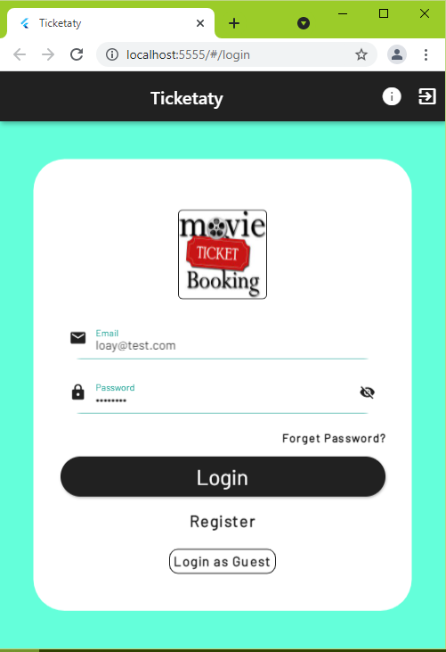
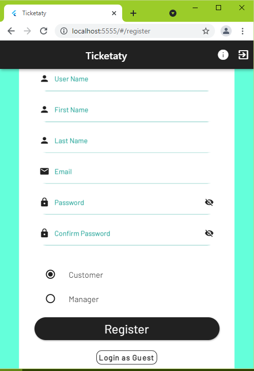
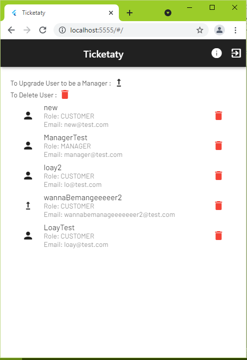
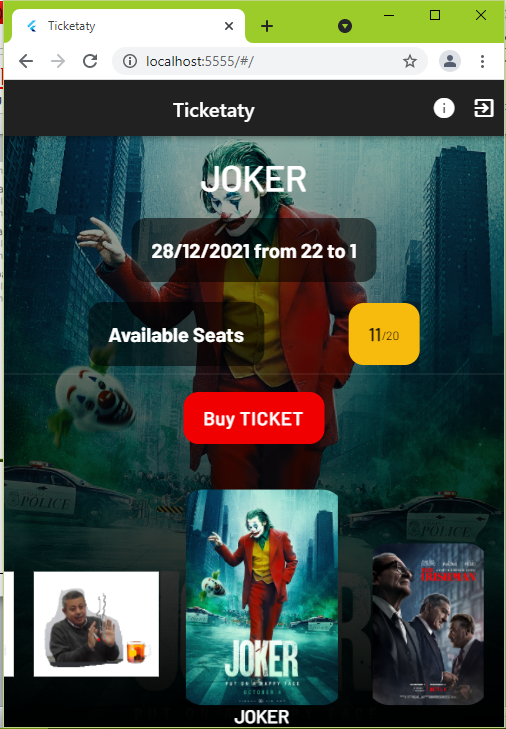
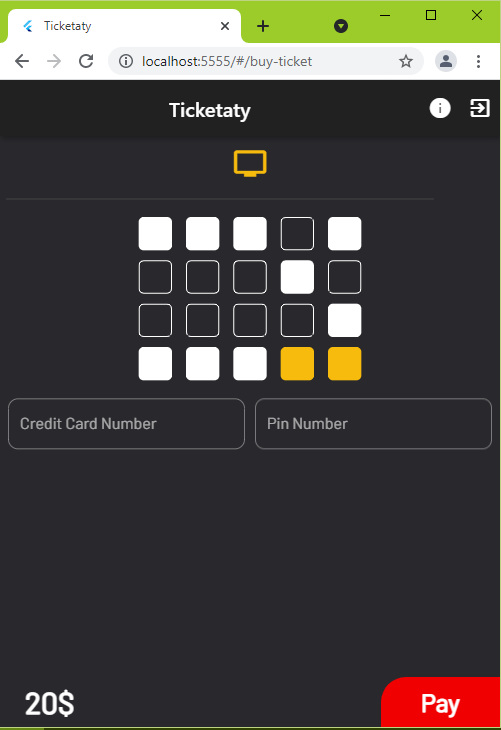
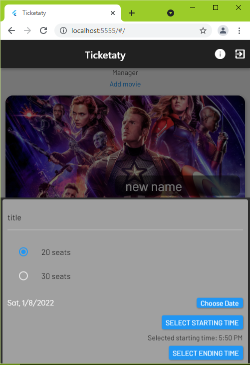

# Movies-Reservation-Webapp

A Movies Reservation Project for CUFE course (Computer Consultations Systems).

## To run project:

- Must have flutter and dart installed.. (min Flutter Version is 2 if you have older version upgrade using `flutter upgrade` )
- Get the packages from ./pubspec.yaml file using `flutter pub get`
- run `flutter run --no-sound-null-safety -d chrome --web-port=5555 --web-renderer=html` - now it's running on localhost:5555

# Screenshots from the Web APP:

## Authentication Pages:

- ### Login Page:
  
- ### Register Page:
  

## Main Pages:

- ### Admin Main Page:
  
- ### Customer / Guest Main Page:
  
- ### Buy Ticket Page:
  
- ### Manager Main Page:
  
- ### Add / Edit Movie View:
  
  
  
